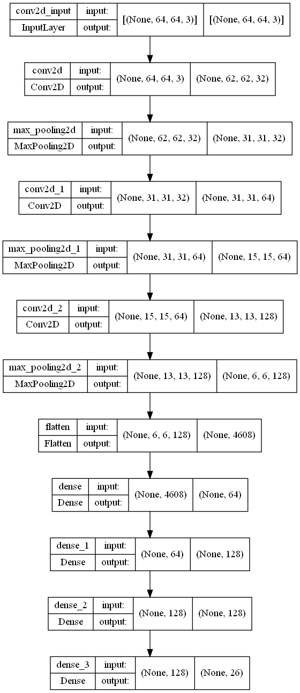

````
NOTE: To run this code, please create and install a conda environment using the conda-env.yml file.
````
All code used from other sources are referenced in respective notebooks.

Used [MNIST dataset](https://www.kaggle.com/datamunge/sign-language-mnist).


